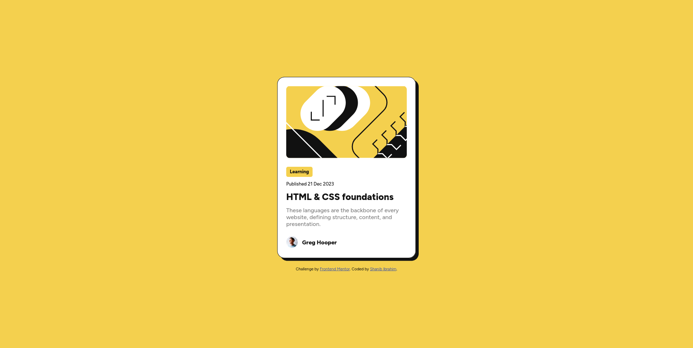
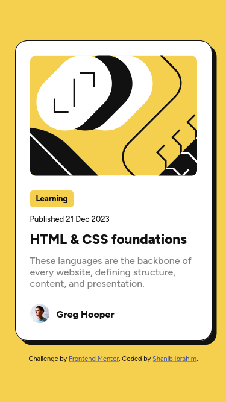

# Frontend Mentor - Blog preview card solution

This is a solution to the [Blog preview card challenge on Frontend Mentor](https://www.frontendmentor.io/challenges/blog-preview-card-ckPaj01IcS). Frontend Mentor challenges help you improve your coding skills by building realistic projects.

## Table of contents

- [Overview](#overview)
  - [Screenshot](#screenshot)
  - [Links](#links)
- [My process](#my-process)
  - [Built with](#built-with)
  - [What I learned](#what-i-learned)
  - [Continued development](#continued-development)
  - [Useful resources](#useful-resources)
- [Author](#author)
- [Acknowledgments](#acknowledgments)

## Overview

### Screenshot




### Links

- Solution URL: [Qr-code-solution](https://github.com/shanib-ibrahim/Frontend-Mentor-Challenge/tree/main/blog-preview-card-main)
- Live Site URL: [Qr-code-live](https://shanib-ibrahim.github.io/Frontend-Mentor-Challenge/blog-preview-card-main/)

## My process

### Built with

- Semantic HTML5 markup
- CSS custom properties
- Flexbox

### What I learned

While working on these challenge i have learned flexbox, positions and HTML Semantic element .

```html
<main role="main">
  <section class="card" role="card">
    <section class="card-image" role="card image"></section>
    <section class="card-head"><p>Learning</p></section>
    <section class="card-date" role="card date">
      <p>Published 21 Dec 2023</p>
    </section>
    <section class="card-content" role="card content">
      <h1>HTML & CSS foundations</h1>
      <p>
        These languages are the backbone of every website, defining structure,
        content, and presentation.
      </p>
    </section>
    <section class="profile">
      <section class="profile-image">
        
      </section>
      <section class="profile-name">Greg Hooper</section>
    </section>
  </section>
</main>
```

```css
@media (max-width: 420px) {
  .card {
    width: 20.438rem;

    > .card-content h1 {
      font-size: 1.4rem;
    }
  }
}
```

### Continued development

The area i need to more focus and learn in CSS and HTML are:

- transform
- translate
- pseudo-elements
- HTML Semantic where i need to use it
- float
- grid

### Useful resources

- [resource 1](https://developer.mozilla.org/en-US/) - This helped me for all CSS and HTML syntax. I really liked this pattern and will use it going forward.

## Author

- github- [@Shanib-Ibrahim](https://github.com/shanib-ibrahim)
- Frontend Mentor - [@shanib-ibrahim](https://www.frontendmentor.io/profile/shanib-ibrahim)

## Acknowledgments

I would recommend everyone thier to get start with frontend mentor Challenge as soon as possible.A good website for beginners to learn CSS and HTML.
