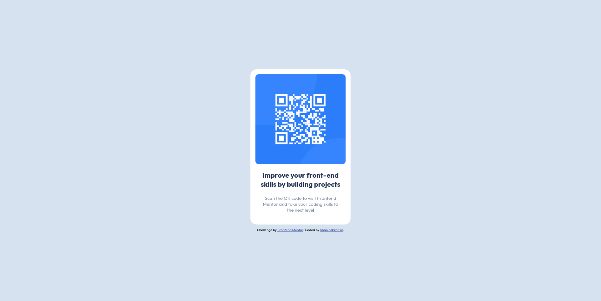

# Frontend Mentor - QR code component solution

This is a solution to the [QR code component challenge on Frontend Mentor](https://www.frontendmentor.io/challenges/qr-code-component-iux_sIO_H). Frontend Mentor challenges help you improve your coding skills by building realistic projects.

## Table of contents

- [Overview](#overview)
  - [Screenshot](#screenshot)
  - [Links](#links)
- [My process](#my-process)
  - [Built with](#built-with)
  - [What I learned](#what-i-learned)
  - [Continued development](#continued-development)
  - [Useful resources](#useful-resources)
- [Author](#author)
- [Acknowledgments](#acknowledgments)

## Overview

### Screenshot




### Links

- Solution URL: [Qr-code-solution](https://github.com/shanib-ibrahim/Frontend-Mentor-Challenge/tree/main/qr-code-component)
- Live Site URL: [Qr-code-live](https://shanib-ibrahim.github.io/Frontend-Mentor-Challenge/qr-code-component/)

## My process

### Built with

- Semantic HTML5 markup
- CSS custom properties
- Flexbox

### What I learned

While working on these challenge i have learned flexbox, positions and HTML Semantic element .

```html
<div class="main">
  
  <h2>Improve your front-end skills by building projects</h2>
  <p>
    Scan the QR code to visit Frontend Mentor and take your coding skills to the
    next level
  </p>
</div>
```

```css
.main {
  display: flex;
  flex-direction: column;
  align-items: center;
  width: 320px;
  height: 497px;
  border-radius: 20px;
  text-align: center;
  background-color: var(--color-white);
  margin-bottom: 10px;
  padding: 1rem;

  > img {
    max-width: 100%;
    height: 288px;
    aspect-ratio: auto;
    border-radius: 10px;
    margin-bottom: 20px;
  }
  > h2 {
    color: hsl(218, 44%, 22%);
  }
  > p {
    margin-top: 5px;
    padding: 1rem;
    color: hsl(220, 15%, 55%);
  }
}
```

### Continued development

The area i need to more focus and learn in CSS and HTML are:

1)transform
2)translate
3)pseudo-elements
4)HTML Semantic where i need to use it
5)float
6)grid

### Useful resources

- [resource 1](https://developer.mozilla.org/en-US/) - This helped me for all CSS and HTML syntax. I really liked this pattern and will use it going forward.

## Author

- github- [@Shanib-Ibrahim](https://github.com/shanib-ibrahim)
- Frontend Mentor - [@shanib-ibrahim](https://www.frontendmentor.io/profile/shanib-ibrahim)

## Acknowledgments

I would recommend everyone thier to get start with frontend mentor Challenge as soon as possible.A good website for beginners to learn CSS and HTML.
