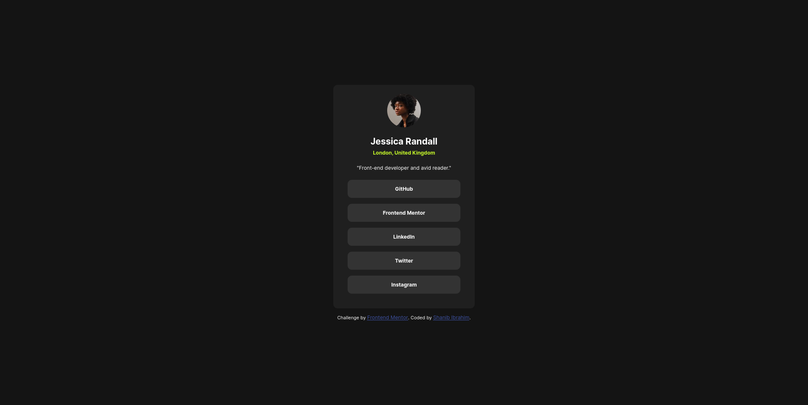
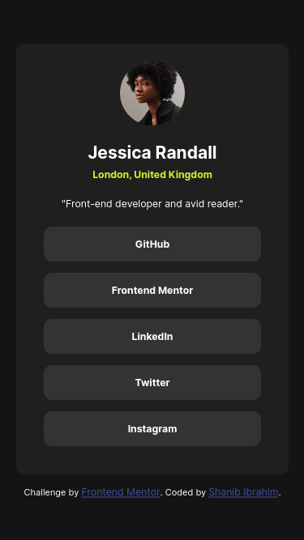

# Frontend Mentor - Social links profile solution

This is a solution to the [Social links profile challenge on Frontend Mentor](https://www.frontendmentor.io/challenges/social-links-profile-UG32l9m6dQ). Frontend Mentor challenges help you improve your coding skills by building realistic projects.


## Table of contents

- [Overview](#overview)
  - [Screenshot](#screenshot)
  - [Links](#links)
- [My process](#my-process)
  - [Built with](#built-with)
  - [What I learned](#what-i-learned)
  - [Continued development](#continued-development)
  - [Useful resources](#useful-resources)
- [Author](#author)
- [Acknowledgments](#acknowledgments)

## Overview

### Screenshot




### Links

- Solution URL: [Qr-code-solution](https://github.com/shanib-ibrahim/Frontend-Mentor-Challenge/tree/main/social-links-profile-main)
- Live Site URL: [Qr-code-live](https://shanib-ibrahim.github.io/Frontend-Mentor-Challenge/social-links-profile-main/)

## My process

### Built with

- Semantic HTML5 markup
- CSS custom properties
- Flexbox

### What I learned

While working on these challenge i have learned flexbox, positions and HTML Semantic element .

```html
<main role="main">
  
  <h1>Jessica Randall</h1>
  <h3>London, United Kingdom</h3>
  <p>"Front-end developer and avid reader."</p>
  <ul>
    <li><a href="#">GitHub</a></li>
    <li><a href="#">Frontend Mentor</a></li>
    <li><a href="#">LinkedIn</a></li>
    <li><a href="#">Twitter</a></li>
    <li><a href="#">Instagram</a></li>
  </ul>
</main>
```

```css
> ul {
  list-style: none;

  > li {
    cursor: pointer;
    font-weight: 700;
    border-radius: 10px;
    padding: 1rem 6rem;
    margin-bottom: 1rem;
    background-color: var(--grey);
    a {
      text-decoration: none;
      color: var(--white);
    }
  }
  > li:hover {
    background-color: var(--primary-green);
    a {
      color: var(--off-black);
    }
  }
}
```

### Continued development

The area i need to more focus and learn in CSS and HTML are:

- transform
- translate
- pseudo-elements
- HTML Semantic where i need to use it
- float
- grid

### Useful resources

- [resource 1](https://developer.mozilla.org/en-US/) - This helped me for all CSS and HTML syntax. I really liked this pattern and will use it going forward.

## Author

- github- [@Shanib-Ibrahim](https://github.com/shanib-ibrahim)
- Frontend Mentor - [@shanib-ibrahim](https://www.frontendmentor.io/profile/shanib-ibrahim)

## Acknowledgments

I would recommend everyone thier to get start with frontend mentor Challenge as soon as possible.A good website for beginners to learn CSS and HTML.
